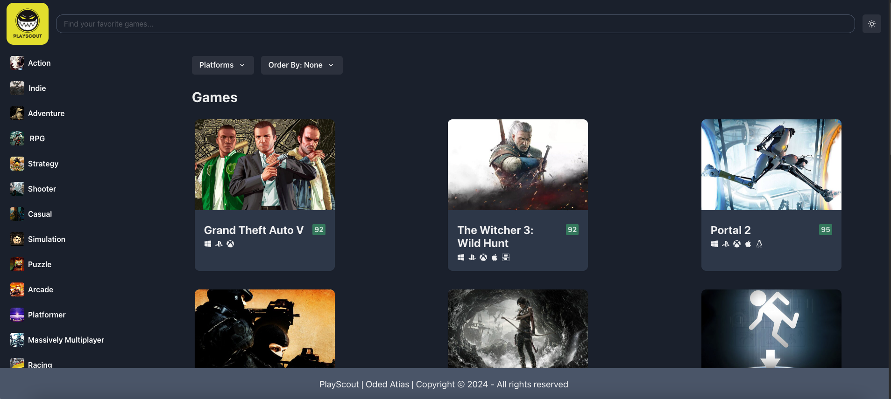

# PlayScout 🎮

PlayScout is a personalized game recommendation platform designed to help users explore and find games they’ll love. Using the RAWG Video Games Database API, PlayScout provides detailed information about games, genres, and platforms to deliver a seamless gaming discovery experience.



---

## Features

🕹️ **Personalized game recommendations** based on user preferences.

🎯 **Search functionality** to find games by title, genre, or platform.

📋 **Detailed game information** including descriptions, ratings, platforms, and screenshots.

❤️ **Favorites management** to keep track of your favorite games.

📅 **Upcoming releases** to stay updated on new games.

---

## Technologies

- **React** for building the web application.
- **Vite** for fast development and build process.
- **TypeScript** for type safety and improved developer experience.
- **RAWG API** for fetching game data, genres, and platform details.

---

## Installation

```bash
# Clone the repository
~$: git clone https://github.com/your-username/playscout.git

# Navigate to the project directory
~$: cd playscout

# Install dependencies
~$: npm install

# Start the project
~$: npm run dev
```

---

## External Style Libraries

- **Google Fonts** for custom typography.
- **Tailwind CSS** for modern, responsive styling.

---

## API Integration

### RAWG API

PlayScout integrates with the [RAWG API](https://rawg.io/apidocs) to fetch:

- Game data
- Genre information
- Platform details

---

## Game Ratings Color Coding

🎨 **Dynamic color coding for ratings:**

- **🔴 Below 60%**
- **🟡 60% to 79%**
- **🟢 80% and above**

---

## Usage Notes

- For the best experience, use the application on modern browsers like **Chrome**, **Firefox**, or **Edge**.
- Ensure a stable internet connection for fetching live data from the RAWG API.

---

## Contribution

Feel free to contribute to PlayScout! Fork the repository, make your changes, and submit a pull request.

---

## Questions?

If you have any questions or feedback, feel free to contact me:

```javascript
if(haveAnyQuestions === true){
    let yourName = ".......", question = ".......";
    sendEmailToMe(yourName, question, "odedatias8115@gmail.com");
}
```
